# Lecturely showcase

An overview of Lecturely: Ace AP/SAT Exams, an AI-native exam prep app published by Pixra Studio. The source code is private. This repo holds screenshots and an architecture write-up only.

## TL;DR

Students preparing for the SAT and AP exams get generic practice and little feedback on free-response answers. Lecturely is a mobile app with a Socratic AI tutor, a free-response grader, adaptive mock exams and a math camera. It is built as a TypeScript monorepo and is in active development.

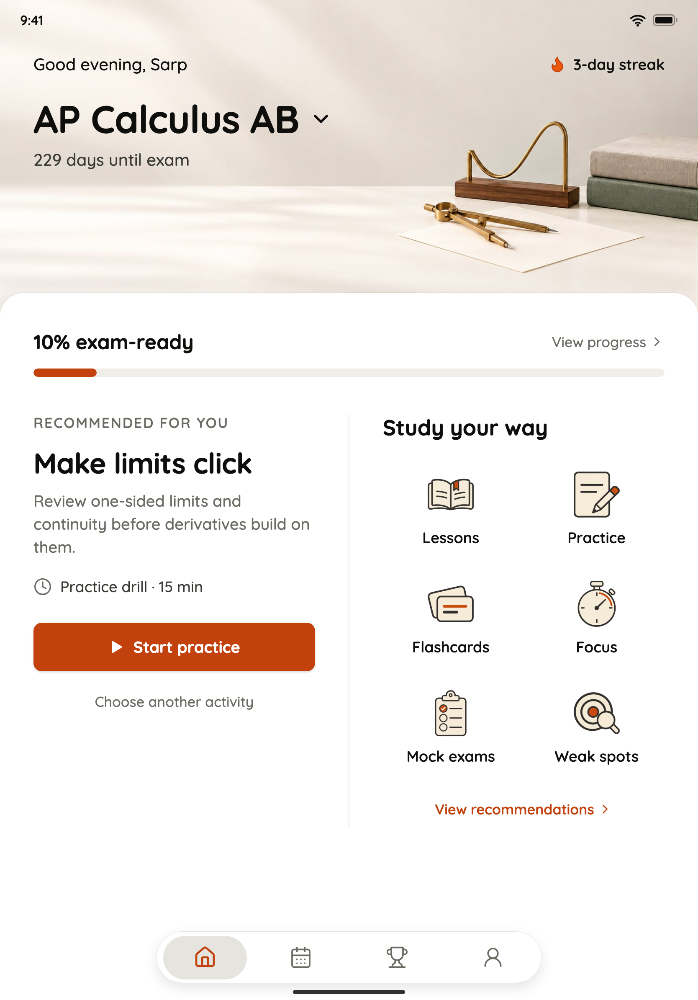

## Product surfaces

- **Socratic tutor ("Ren").** A chat tutor that retrieves concepts and cites them.
- **Free-response grader.** Rubric-based grading of free-response answers.
- **Adaptive mock exams.** Mock exams that adapt to the student.
- **Math camera.** Take a photo of a problem and get help.
- **Also in the app:** flashcards, a lesson reader, a study plan, streaks, offline study packs, and a desktop authoring app for lessons.

## Screenshots

These ten images are design mocks of the iPad redesign. They are not screenshots of the shipped app. They were rendered from the design canvas and show sample data only.

| | |
|---|---|
|  | 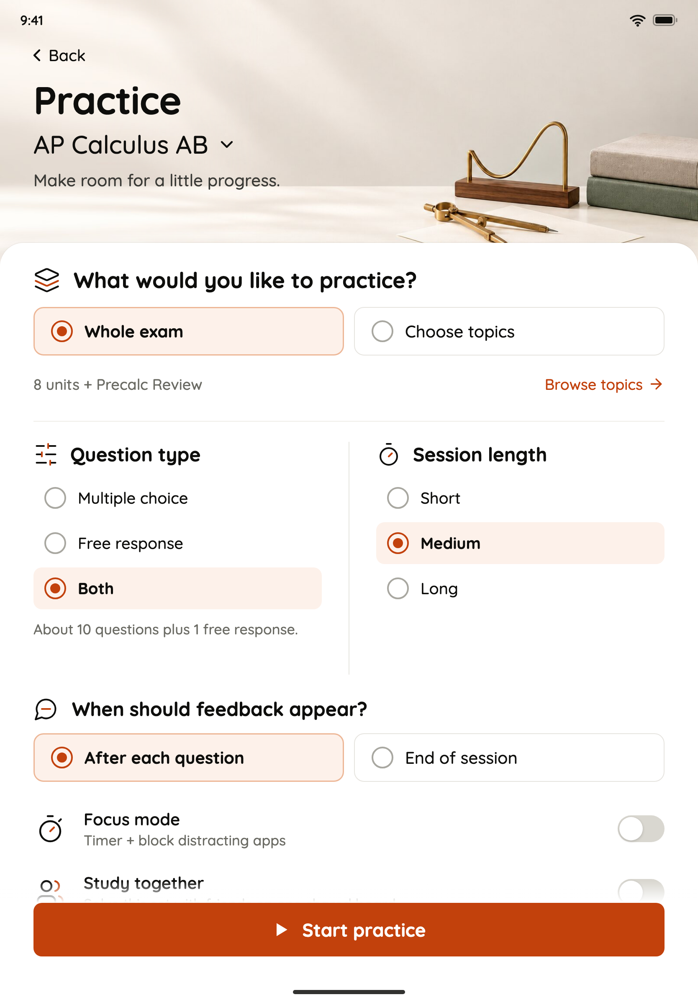 |
| 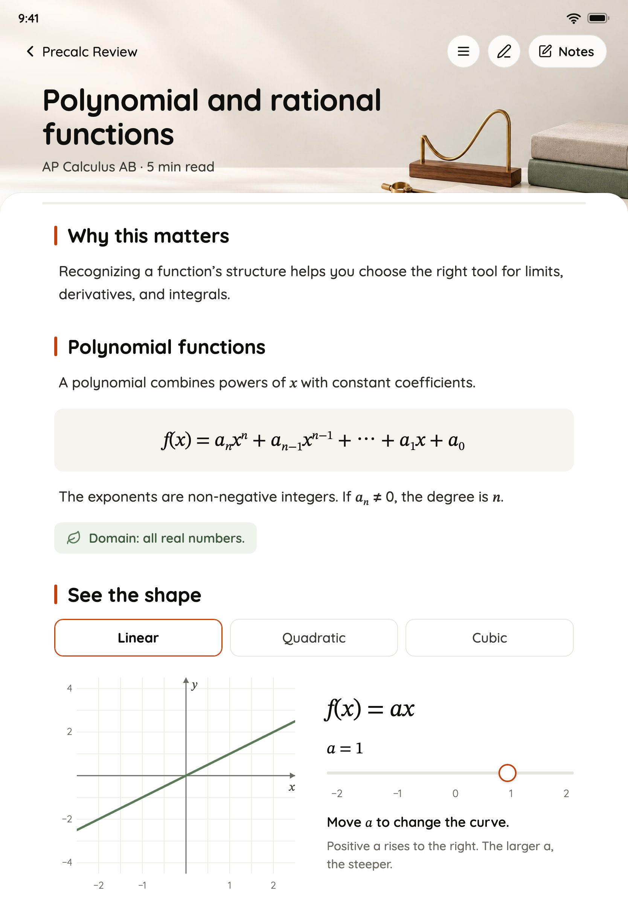 | 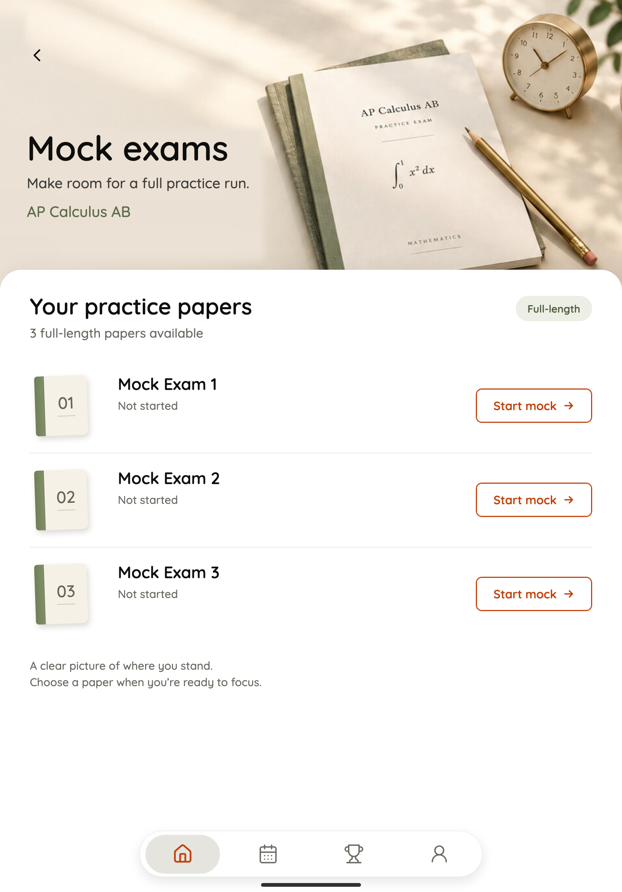 |
| 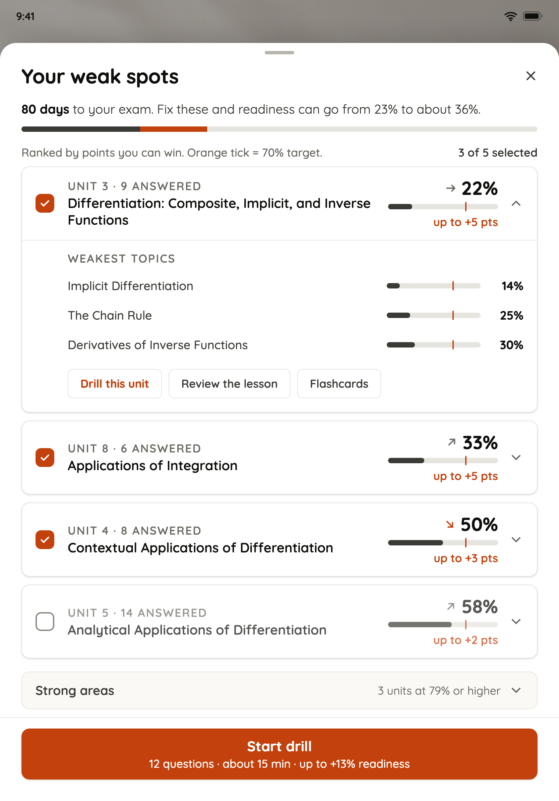 | 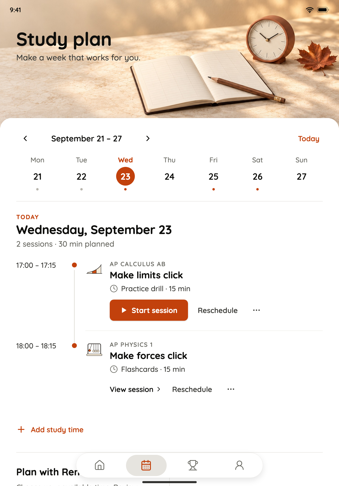 |
| 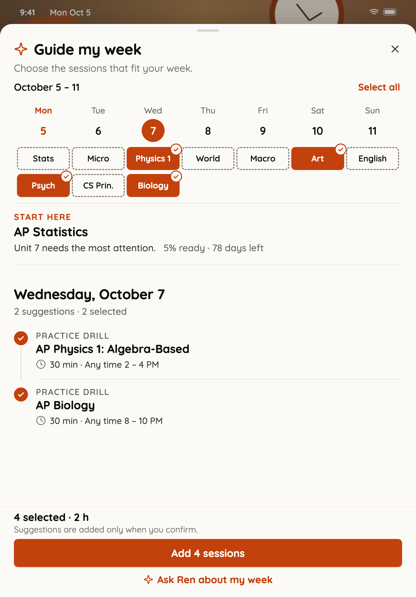 | 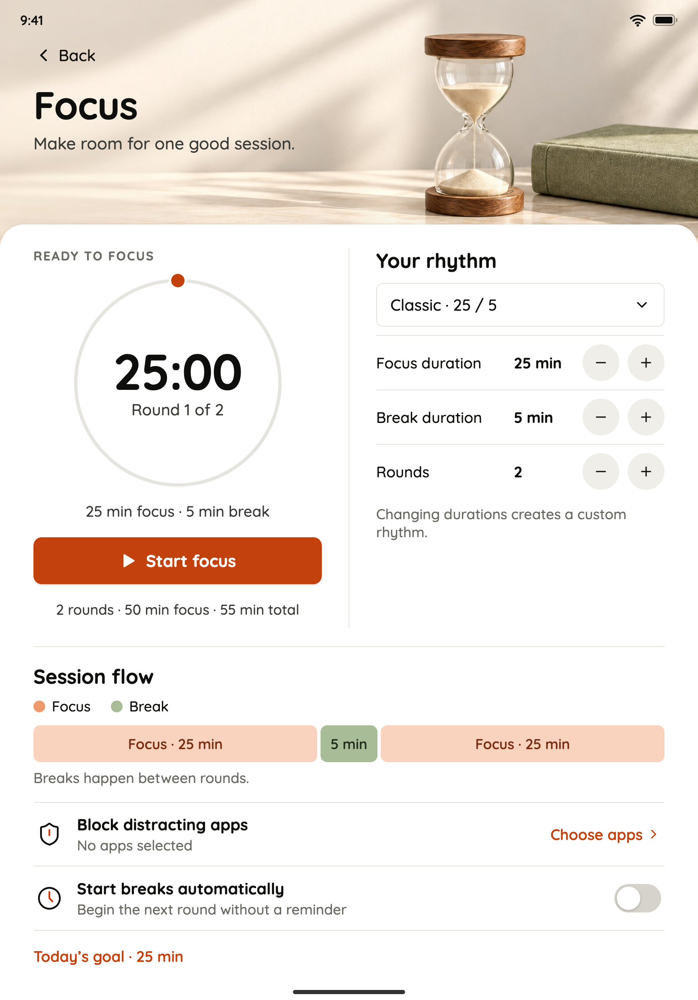 |
| 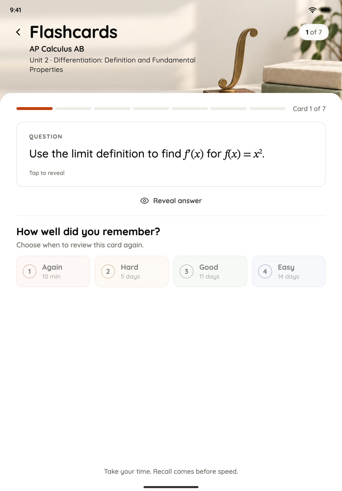 | 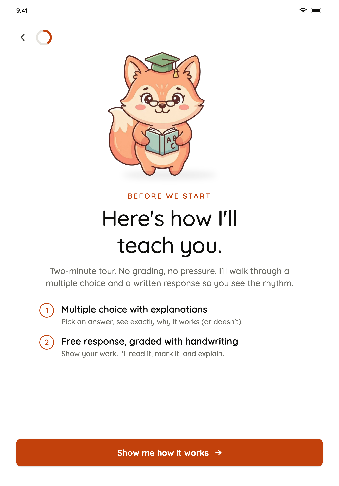 |

Design language and architecture (drawn, not screenshots):

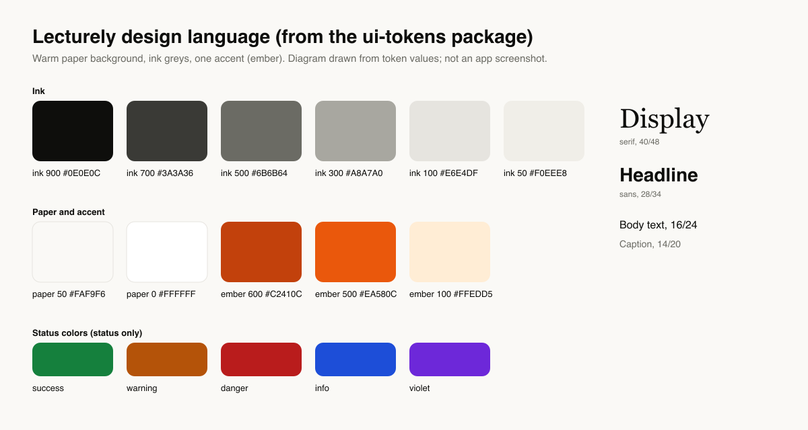

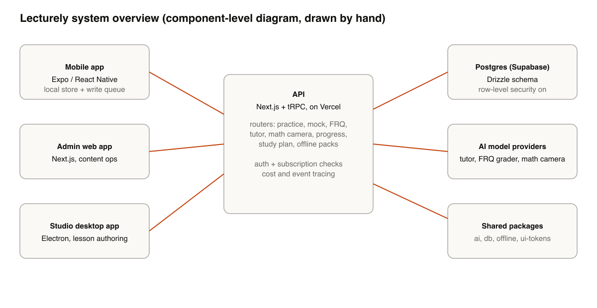

The mascot and the app icon:

 

## Tech stack

Expo and React Native for the client. Next.js and tRPC for the API. Drizzle ORM on Postgres. pnpm workspaces with Turborepo. Electron for the lesson authoring app.

## Architecture

See [docs/architecture.md](docs/architecture.md).

## My role

I founded Lecturely and build the product.

## Limitations

The code is private, so nothing here can be run. The screenshots may lag the current app. No FRQ grader or math camera screens are shown yet.

## Contact

[LinkedIn](https://www.linkedin.com/in/sarpvulas/)

All images and text in this repository are all rights reserved.
