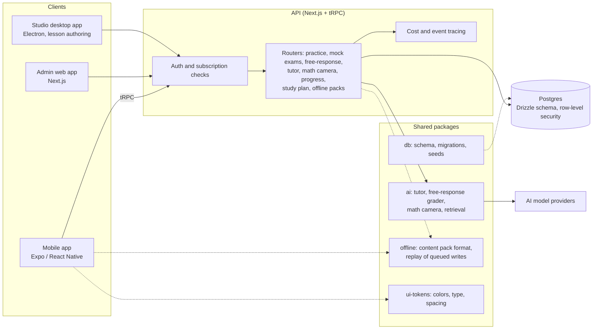

# Architecture

A component-level view. It describes no prompts, schemas, table contents or pricing logic.

## Data flow

1. A client calls a typed tRPC procedure. A procedure is public, onboarding-only, or needs a signed-in, subscribed user.
2. Routers read and write Postgres through Drizzle. Row-level security is on for every public table.
3. The AI features (tutor, free-response grader, math camera) run in the `ai` package. SDK calls are injected as dependencies, the code validates model output before it uses it, and it logs usage cost as events.
4. Answer-key material reaches the client only after the student has answered. This is a rule of the design.

## Offline study

The app has a downloadable content pack format with a schema version, a local database on the device, and a queue that replays writes when the device is online again. Offline study is partly implemented.

## Not shown

Prompts, rubric and grading logic, content seeds, database contents, billing and pricing logic.
